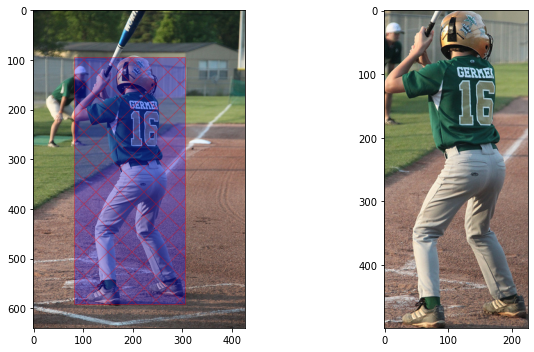
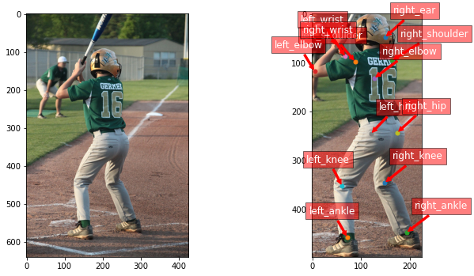
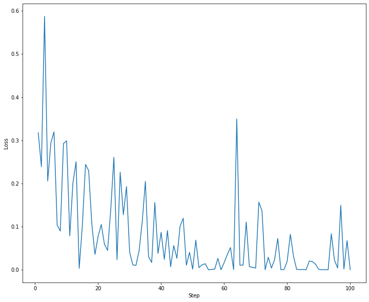

# Human Pose Estimator

## Introduction
This project is a solution for the live project on the [Manning publications website](https://www.manning.com/)
. The website provide some instructions and its up to each participant how to approach the solution. I find it quite interesting
and easy to follow, plus you have to do with something real and develop your skills to the next level.

## Chapter 1
The first chapter is about downloading the datasets and get familiar with them. The two datasets are the [SHVN](http://ufldl.stanford.edu/housenumbers/) 
and the [COCO](https://cocodataset.org/#keypoints-2017). Links are provided for the official websites.

The website provides a script to download the data from a S3 bucket on AWS cloud. After downloading the data 
I wrote a small script to visualise and understand the dataset. Running the pose_estimator_01.py you take the 
following results:

This image shoes that I successfully draw a box around the human and crop the image to the given coordinates

Same image as before but after I found the box coordinates I plot the keypoints the represent all the visible
body parts of the human depicted on the picture

The jupyter notebook with all the code you can find here: [notebok](01.HumanPoseEstimator.ipynb)

## Chapter 2

In this chapter I will made and train a CNN (Convolution Neural Network) model to recognise numbers depicted on images with street numbers 
(SHVN dataset). To solve this problem I am decide to go with the CNN architecture as it thrives in image recognition. 

My model architecture consists of two convolution layers followed with a Batch Normalization layer, 
a Relu activation function and a Max-Pool layer. The output of the final convolution layer passes through a Dense layer
 where all dimensions are flattened and then passed to a final Dense layer where a prediction is made.
 
The final accuracy after 100 epochs of training is 92.1212% on the test set.

This is an image of the loss during the training process.

There is a lot of room for development for this model. The spikes seen on the graph are probably from batch training, and 
from images that the model has not seen before this batch. Choosing a bigger batch size will probably smooth the loss plot.

 

